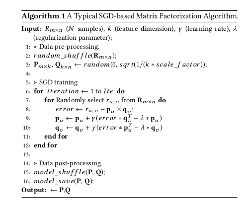
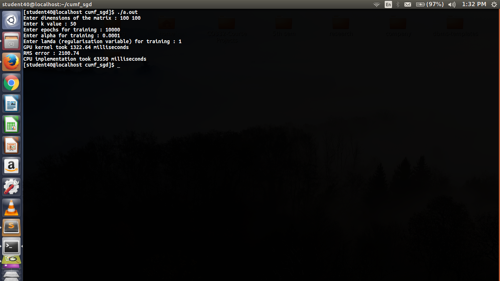

# NMF-CUDA
Implementation of various algorithms like Stochastic Gradient Descent, Alternating Least squares	 for Non-Negative matrix factorisation using CUDA.

### Stochastic Gradient Descent

#### Serial algorithm

#### Parallel vs Serial Runtime

